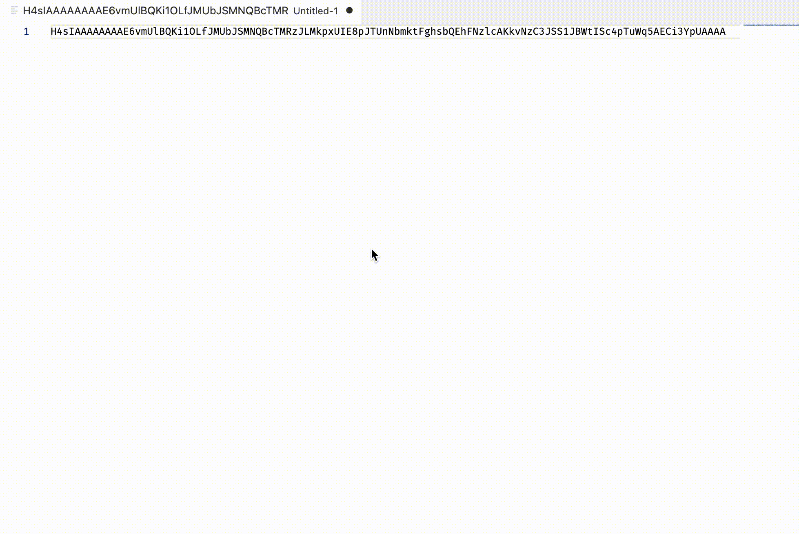

# Gzip / Unzip text

 

Gzip text to Base64 and Unzip Base64 text to plain text.

## Features

Transform selected text:

- from plain text to Base64 Gzip text
- from Gzip Base64 text to plain text

